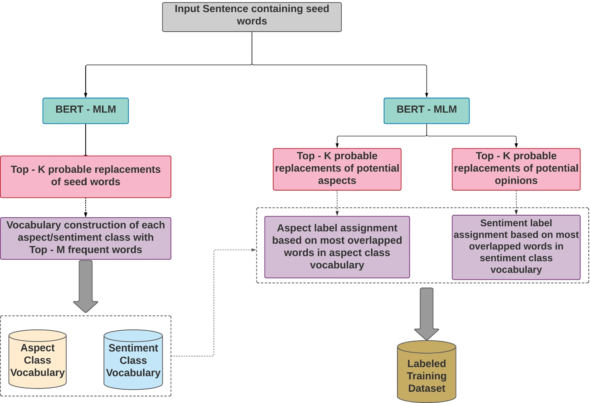
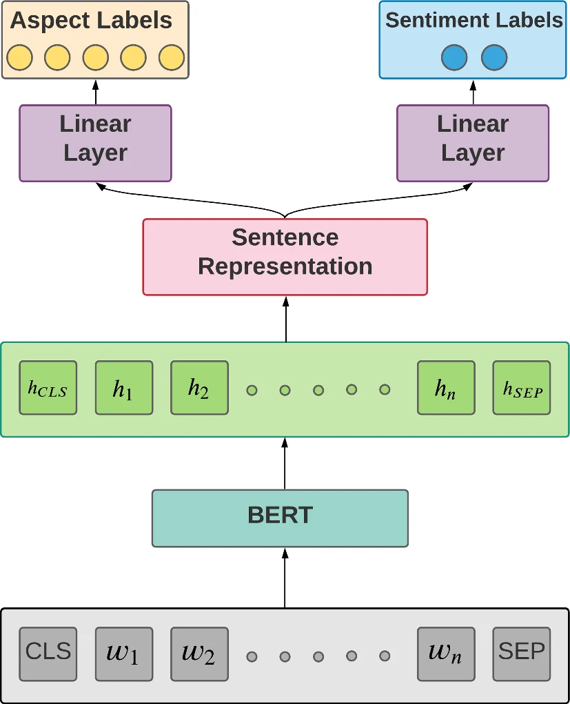

# Semi-Supervised BERT-Based Aspect-Based Sentiment Analysis

In this project I re-implemented the model from the paper [BERT Based Semi-Supervised Hybrid Approach for Aspect and Sentiment Classification](https://link.springer.com/article/10.1007/s11063-021-10596-6). The paper addresses [Task 5](https://alt.qcri.org/semeval2016/task5/) in the [SemEval-2016](https://alt.qcri.org/semeval2016/index.php?id=tasks) workshop. This is the major dataset for aspect-based sentiment analysis (ABSA). The author's code was written in PyTorch; I re-wrote it in TensorFlow and was able to replicate the author's results. I also fixed a few bugs, and refactored parts. 

I found the author's data augmentation technique quite interesting. Most aspect-based sentiment analysis tasks suffer from a lack of a large annotated dataset. Their semi-supervised labeling method is something I'd like to keep in mind for future NLP projects.

## Data Labeling

## Model

